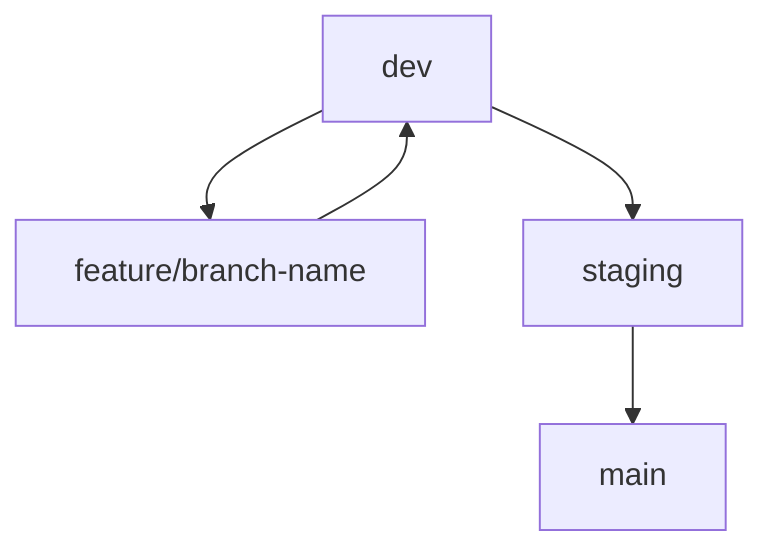

# 🤝 Contributors Guide

Welcome to the contributors guide for this project!  
We follow a structured, DevOps-oriented development process with clear branch and CI/CD pipelines.  
Please read this guide carefully before contributing.

---

## 🌱 Branching Strategy

We use three primary branches, each mapping to a deployment environment:

| Branch   | Environment           |
|----------|-----------------------|
| `main`   | Production            |
| `staging`| Pre-Production / QA   |
| `dev`    | Development           |

All feature/fix branches must be created from `dev` and merged back via Pull Requests.

---

## 📌 Naming Conventions

| Type          | Branch name format          |
|---------------|-----------------------------|
| Feature       | `feature/lior/your-feature-name` |
| Bug fix       | `fix/itay/your-fix-name`         |
| CI-related    | `ci/lior/update-ci-pipeline`     |
| Documentation | `docs/itay/update-readme`        |

---

## 🚀 Git Flow Diagram



This flow ensures proper testing before production releases.

---

## 🔍 Commit Guidelines

We use **Conventional Commits** for clarity and automation.

Examples:

- `feat: add new user profile UI`
- `fix: correct login redirect`
- `ci: update deployment script`

---

## ✅ Code Quality

Each Pull Request is subject to:

- Automated Linting (`npm run lint`)
- Unit Testing (`npm test`)
- CI Build (GitHub Actions)
- Docker Image Build & Push to GitHub Packages

All checks must pass before merging.

---

## 📦 CI/CD Overview

GitHub Actions is our main CI tool.

**Trigger:** push to `dev`, `staging`, or `main`

**Pipeline steps:**

- Checkout
- Node install (`npm ci`)
- Lint
- Tests
- Build (`npm run build`)
- Docker build & push

Artifacts are automatically deployed or made available for each environment.

---

## 💪 Test GitHub Actions Locally with ACT

We support local testing of the GitHub Actions pipeline using **act**.

**Why use ACT?**

- Simulate GitHub Actions locally before pushing code
- Save time during development
- Detect issues early

**How to use:**

1. Install ACT:  
   https://nektos.github.io/act/

2. Run ACT:  
   ```bash
   act --workflows ".github/workflows/ci-dev.yml" --job "build-and-test"
   ```

Make sure Docker is running, since act uses containers.


## 🧪 Testing

All code must include:

- Unit Tests  
- Optional: E2E tests (Cypress/Playwright)  

Tests are required to pass in the CI pipeline.

---

## 🌐 Deployment Tags Convention

Docker images are tagged by:

```
{project-name}-{branch}:{version-from-package-json}
```

Example: `CV-careerVision-dev:1.2.0`

---
---

## 👤 Roles & Responsibilities

| Role        | Responsibility                          |
|-------------|----------------------------------------|
| Developers  | Code, tests, commit messages, branches |
| DevOps      | CI/CD, infra, deployment pipelines, reviews |
| Reviewers   | Code reviews, quality enforcement       |

---

## 🛡️ Security and Access

- Secrets are managed in GitHub Actions > Secrets  
- Only maintainers can trigger deployment to `main`

---

## 🧐 Final Words

You're part of a Total-Juniors project. Let's build clean, scalable, and testable software — together.

For any questions, ping the DevOps lead. Happy coding!

---
